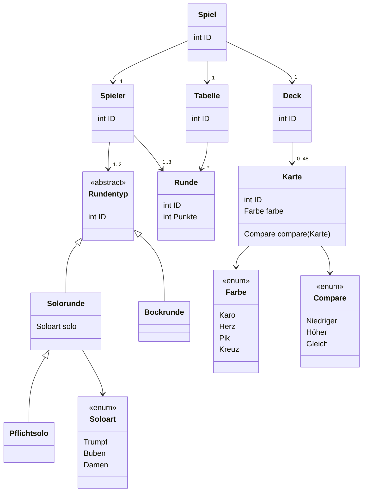

```mermaid
classDiagram

class Spiel {
  int ID
}

class Spieler {
  int ID
}

class Deck {
  int ID
}

class Karte {
  int ID
  Farbe farbe
  Compare compare(Karte)
}

class Tabelle {
  int ID
}

class Runde {
  int ID
  int Punkte
}

class Rundentyp {
  <<abstract>>
  int ID
}

class Solorunde {
  Soloart solo
}

class Pflichtsolo 

class Bockrunde 

class Farbe {
  <<enum>>
  Karo
  Herz
  Pik
  Kreuz
}

class Compare {
  <<enum>>
  Niedriger
  Höher
  Gleich
}

class Soloart {
  <<enum>>
  Trumpf
  Buben
  Damen
}

Spiel --> "1" Tabelle
Spiel --> "1" Deck
Spiel --> "4" Spieler

Deck --> "0..48" Karte

Tabelle --> "*" Runde

Spieler --> "1..3" Runde
Spieler --> "1..2" Rundentyp

Rundentyp <|-- Solorunde
Rundentyp <|-- Bockrunde
Solorunde <|-- Pflichtsolo

Karte --> Farbe
Karte --> Compare
Solorunde --> Soloart
```
